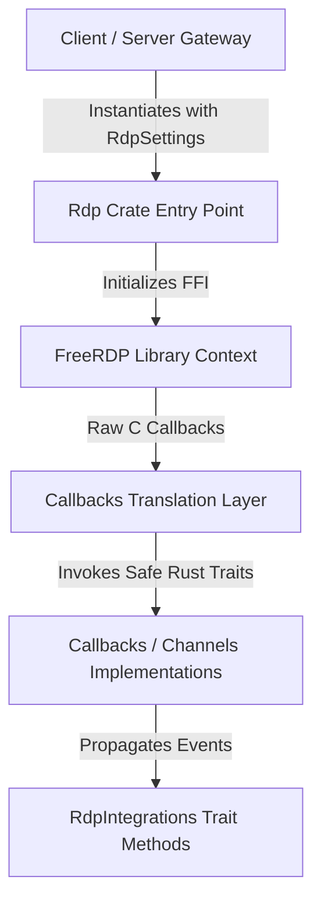

# Reference Guide: Unified RDP Wrapper Crate

This document describes the design, architecture, and programming interface of the unified `rdp` crate. This crate is designed to serve as a 100% identical codebase in both client and gateway implementations so it can eventually be extracted into a standalone library.

---

## 1. Core Architecture

The crate acts as a safe Rust wrapper around `FreeRDP` via raw FFI bindings in `freerdp-sys`. It manages the connection lifecycle, events, and channel callbacks:



---

## 2. Configuration System

### `RdpSettings`
Contains all target parameters, rendering instructions, and redirection configurations.

```rust
pub struct RdpSettings {
    pub server: String,
    pub port: u32,
    pub user: String,
    pub password: String,
    pub domain: String,
    pub screen_size: ScreenSize,
    pub best_experience: bool,
    pub redirections: RdpRedirections,
    pub rail: Option<RailSettings>,
    pub features: RdpFeatures,
    pub options: RdpOptions,
}

pub struct RdpFeatures {
    pub disable_threading: bool,
    pub force_software_gdi: bool,
}

pub struct RdpOptions {
    pub use_nla: bool,
    pub verify_cert: bool,
    pub use_local_scaler: bool,
    pub use_tunnel: bool,
    pub desktop_scale: f64,
}
```

### `RdpRedirections`
Redirection features grouped logically under a nested block:

```rust
pub struct RdpRedirections {
    pub clipboard: bool,
    pub audio: bool,
    pub mic: bool,
    pub printing: bool,
    pub drives: Vec<String>,
    pub webcam: Option<WebcamSettings>,
    pub sound_latency_threshold: Option<u16>,
}
```

### `RailSettings` & `RailBehavior`
Enables RemoteApp mode and sets the rendering behavior strategy.

```rust
pub struct RailSettings {
    pub app: String,
    pub args: Option<String>,
    pub working_dir: Option<String>,
    pub title: Option<String>,
    pub server_info: Option<ServerInfo>,
    pub behavior: RailBehavior,
}

pub enum RailBehavior {
    /// Mode A: Composites window updates onto a single desktop primary GDI canvas.
    /// Emits general `UpdateRects` messages. Minimal metadata parsed for windows.
    CompositeGdi,

    /// Mode B: Intercepts graphics surfaces individually.
    /// Emits `WindowPixels` and rich metadata (owners, parents, styles, icons).
    IndividualWindows,
}
```

---

## 3. Integration System (Traits)

To run in both desktop clients (`uds-client` using JS/Egui/Qt) and HTML5 servers (`rdphtml5` using WebSockets/WebCodecs), the crate decouples I/O side-effects through type-safe traits passed inside the `RdpIntegrations` container.

```rust
pub struct RdpIntegrations {
    pub clipboard: Option<Box<dyn ClipboardIntegration>>,
    pub audio_output: Option<Box<dyn AudioOutputIntegration>>,
    pub audio_input: Option<Box<dyn AudioInputIntegration>>,
    pub webcam: Option<Box<dyn WebcamIntegration>>,
}
```

### `ClipboardIntegration`
Handles bidirectional text and format synchronization.
```rust
pub trait ClipboardIntegration: Send + Sync + std::fmt::Debug {
    fn on_format_advertised(&self, format: u32);
    fn on_data_received(&self, format: u32, data: &[u8]);
    fn register_callback(&self, callback: Box<dyn ClipboardCallback>);
}
```

### `AudioOutputIntegration`
Outputs audio packets received from the server.
```rust
pub trait AudioOutputIntegration: Send + Sync + std::fmt::Debug {
    fn play_samples(&self, format: u16, channels: u16, rate: u32, data: &[u8]);
}
```

### `AudioInputIntegration`
Supplies microphone capture samples to be transmitted to the RDP server.
```rust
pub trait AudioInputIntegration: Send + Sync + std::fmt::Debug {
    fn capture_samples(&self) -> Option<Vec<i16>>;
    fn set_format(&self, sample_rate: u32, channels: u32);
}
```

### `WebcamIntegration`
Supplies captured webcam frames for the MS-RDPECAM channel.
```rust
pub trait WebcamIntegration: Send + Sync + std::fmt::Debug {
    fn is_h264_available(&self) -> bool;
    fn get_camera_dimensions(&self) -> (u32, u32);
    fn get_max_dimensions(&self) -> (u32, u32);
    fn get_fps(&self) -> u32;
    fn set_mode(&self, mode: WebcamMode);
    fn set_format(&self, format: u32, width: u32, height: u32, fps: u32);
    fn start_stream(&self, width: u32, height: u32, fps: u32) -> flume::Receiver<WebcamFrame>;
    fn stop_stream(&self);
    fn request_sample(&self, channel_ptr: usize);
    fn push_frame(&self, data: Vec<u8>);
    fn set_limits(&self, _quality: u32, _fps: u32, _max_width: u32, _max_height: u32) {}
    fn get_device_name(&self) -> String {
        "UDS Camera".to_string()
    }
}
```

---

## 4. Callbacks & Event Loop Translation

The crate exposes traits representing various callback groups defined by FreeRDP:

- `UpdateCallbacks`: General rendering updates (primary draw, GDI painting, palette setups).
- `PointerCallbacks`: Cursor movement and cursor image/icon changes.
- `WindowCallbacks`: Window lifecycle events (create, update, delete, active state changes).
- `InstanceCallbacks`: General instance authentication and verification.

Each callback group is bound at connection initialization time, bridging low-level FFI C-style pointers into these safe, high-level Rust traits.
